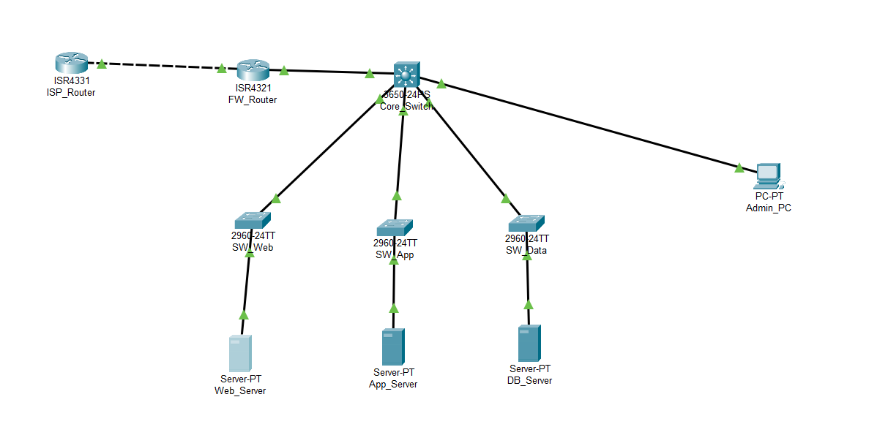

# 3-Tier Web Application Network Architecture

## Project Description
This lab demonstrates an enterprise-grade three-tier web application network architecture with secure segmentation, inter-VLAN routing, and comprehensive security policies following the principle of least privilege.

## Topology


## 🗂️ Lab Files
- [`3tier-webapp-architecture.pkt`](./3tier-webapp-architecture.pkt) - Download and open in Packet Tracer

## Technologies Used
- VLAN Segmentation
- Inter-VLAN Routing
- Access Control Lists (ACLs)
- Static Routing
- DHCP Services
- Network Security Policies

## Project Objectives
- Design and implement secure network segmentation for web application tiers
- Configure VLANs and inter-VLAN routing on Layer 3 switch
- Implement security policies using ACLs between tiers
- Establish proper routing between internal networks and internet
- Test and validate end-to-end connectivity

## Implementation Steps

### Phase 1: Network Foundation & Core Infrastructure
- Deployed and cabled core network devices (ISP Router, Firewall Router, Core Switch)
- Configured WAN connectivity between ISP and Firewall Router
- Set up LAN interface between Firewall Router and Core Switch

### Phase 2: VLAN Segmentation & Inter-VLAN Routing
- Created VLANs for each application tier (Web, App, Data, Management)
- Configured access ports on tier switches for server connectivity
- Established trunk ports between access and core switches
- Implemented inter-VLAN routing using SVIs on Core Switch
- Configured static routing for internet connectivity

### Phase 3: Server Deployment & Service Configuration
- Deployed HTTP services on each tier simulating application functionality
- Web Tier: User-facing web servers (Port 80)
- Application Tier: Business logic servers (Port 80)
- Data Tier: Database API simulation (Port 80)

### Phase 4: Security Policy Implementation
- Configured ACLs to enforce security between tiers:
  - WEB_TO_APP_ACL: Restricts Web Tier to App Tier communication
  - APP_TO_DATA_ACL: Controls App Tier to Data Tier access
  - INTERNET_TO_WEB_ACL: Manages internet to Web Tier traffic

## Configuration Highlights

### VLAN Configuration
```bash
VLAN 10: Web Tier - 10.0.10.0/24
VLAN 20: Application Tier - 10.0.20.0/24  
VLAN 30: Data Tier - 10.0.30.0/24
VLAN 99: Management - 10.0.99.0/24
```

### 🔒 Security ACLs
```bash 
! Web to Application Tier Restriction
permit tcp 10.0.10.0 0.0.0.255 host 10.0.20.10 eq 80
deny ip 10.0.10.0 0.0.0.255 10.0.20.0 0.0.0.255

! Application to Data Tier Restriction
permit tcp host 10.0.20.10 host 10.0.30.10 eq 80
deny ip 10.0.20.0 0.0.0.255 10.0.30.0 0.0.0.255
````
### ✅ Verification & Testing
- ✅ Internet to Web Tier connectivity
- ✅ Web Tier to Application Tier communication
- ✅ Application Tier to Data Tier access
- ✅ Inter-VLAN routing functionality
- ✅ Security policy implementation

### Challenges & Solutions
- 🎯 Challenge: Packet Tracer ACL limitations for inter-VLAN traffic
- 🦾 Solution: Documented intended security design and workarounds
- 🎯 Challenge: Complex routing between multiple tiers
- 🦾 Solution: Implemented static routes and proper gateway configuration

### Skills Demonstrated
- Enterprise network design and segmentation
- VLAN configuration and management
- Inter-VLAN routing implementation
- Network security policy design
- Access Control List configuration
- Network troubleshooting and validation
