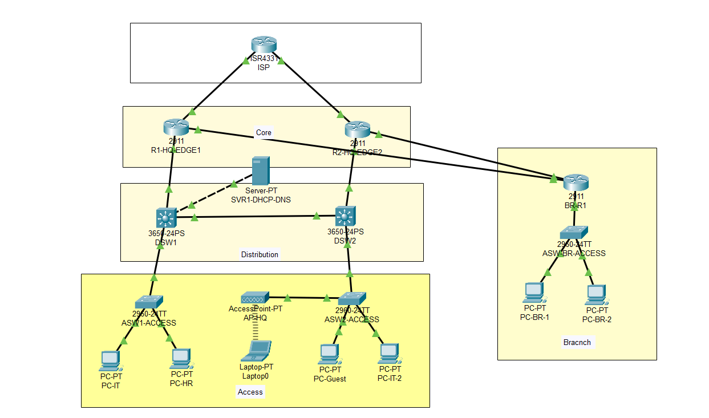

# Enterprise Network Lab - HQ with Branch Site

**Dual WAN, HSRP Redundancy, OSPF Routing, and Comprehensive Security**

## 📋 Lab Overview
Complete enterprise network featuring headquarters with redundant core infrastructure and branch office with dual-homed WAN connectivity.

## 🛠️ Skills Demonstrated
- HSRP gateway redundancy
- OSPF dynamic routing
- Dual WAN connectivity with failover
- Multi-VLAN segmentation (IT, HR, Guest)
- Advanced security policies (ACLs, Port Security)
- Wireless network integration
- NAT/PAT configuration

## 🗂️ Lab Files
- [`enterprise-hq-branch-network.pkt`](./enterprise-hq-branch-network.pkt) - Download and open in Packet Tracer

## 📊 Network Architecture

### VLAN Segmentation
| VLAN | Name | Network | Gateway | Purpose |
|------|------|---------|---------|---------|
| 10 | IT | 10.10.10.0/24 | 10.10.10.1 | IT Department, Servers |
| 20 | HR | 10.10.20.0/24 | 10.10.20.1 | HR Department |
| 30 | Guest | 10.10.30.0/24 | 10.10.30.1 | Guest Network |
| 999 | BLACKHOLE | - | - | Unused ports |

### Redundancy Features
- **HSRP:** Gateway redundancy for all VLANs
- **Dual WAN:** Primary and backup internet connections
- **OSPF:** Dynamic routing with fast convergence
- **EtherChannel:** Trunk redundancy between switches

## 🔧 Key Configurations

### HSRP Redundancy
- Active/standby gateway configuration
- Priority and preemption settings
- Virtual IP addresses for each VLAN

### OSPF Dynamic Routing
- Multi-area OSPF implementation
- Route redistribution
- Fast convergence during link failures

### Dual WAN Connectivity
- Primary and backup internet links
- Automatic failover between ISPs
- Load balancing capabilities

### Security Implementation
- Guest network isolation (ACL 100)
- Port security on access switches
- Management access restrictions
- Unused port hardening

## ✅ Testing & Verification

### Connectivity Tests
- Inter-VLAN routing between departments ✅
- Internet access from all internal VLANs ✅
- Branch office connectivity ✅
- Guest network isolation ✅
- HSRP failover testing ✅

### Redundancy Tests
- WAN failover between R1 and R2 ✅
- Gateway failover between DSW1 and DSW2 ✅
- OSPF route convergence ✅

## 🎯 Learning Outcomes
- Enterprise network design principles
- High availability and redundancy configurations
- Dynamic routing protocol implementation
- Advanced security policy deployment
- Multi-site network integration

## 🔒 Passwords to use
- Enable secret - pa$$enc0de
- Consloe line pass - pa$$linec0de
- Vty line - adm1npa$$c0de

---

*Lab completed: Nov 2025*  
**Author:** Vache Vardanyan

> **💡 Download the [Packet Tracer file](./enterprise-hq-branch-network.pkt) to explore this enterprise network!**
