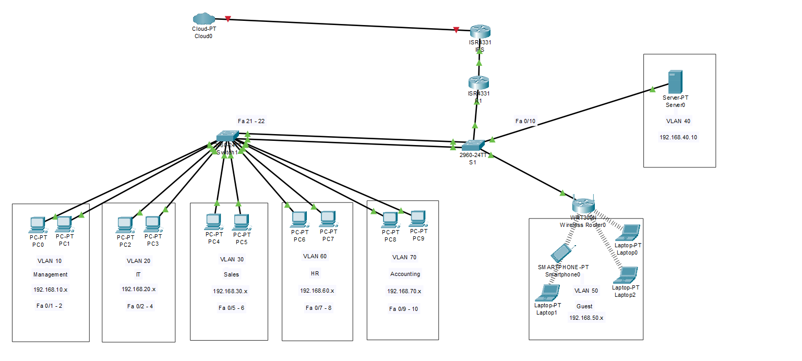

# Enterprise Office Network

**7-VLAN Segmentation with Security, Wireless, and Centralized Services**

## 📋 Lab Overview
Complete small office network serving 50 employees across 6 departments with centralized services, security policies, and guest Wi-Fi access.

**Business Requirements:**
- **Employees:** 50 total across 6 departments
- **Shared Resources:** DHCP + File Server in dedicated Servers VLAN
- **Security:** Network segmentation, guest isolation, server access control

## 🛠️ Skills Demonstrated
- Multi-VLAN enterprise segmentation
- Router-on-a-Stick with 7 subinterfaces
- DHCP and file server configuration
- Advanced ACL security policies
- Wireless network setup (WPA2-PSK)
- Port security and EtherChannel
- NAT for internet access

## 🗂️ Lab Files
- [`enterprise-office-network.pkt`](./enterprise-office-network.pkt) - Download and open in Packet Tracer

## 📊 Network Architecture

### VLAN Design (7 VLANs)
| VLAN | Department | Network | Gateway | Description |
|------|------------|---------|---------|-------------|
| 10 | Management | 192.168.10.0/24 | 192.168.10.1 | Network administrators |
| 20 | IT | 192.168.20.0/24 | 192.168.20.1 | IT support staff |
| 30 | Sales | 192.168.30.0/24 | 192.168.30.1 | Sales team |
| 40 | Servers | 192.168.40.0/24 | 192.168.40.1 | Infrastructure servers |
| 50 | Guests | 192.168.50.0/24 | 192.168.50.1 | Guest Wi-Fi (isolated) |
| 60 | HR | 192.168.60.0/24 | 192.168.60.1 | Human resources |
| 70 | Accounting | 192.168.70.0/24 | 192.168.70.1 | Finance department |

## 🔧 Implementation Phases

### Phase 1-2: Device Setup & VLAN Configuration
- Hostname, security passwords, MOTD banners
- 7 VLANs created with proper naming

### Phase 3: Trunk & EtherChannel
- SW1 ⇔ R1: Trunk carrying all VLANs
- SW1 ⇔ SW2: EtherChannel trunk for redundancy
- SW1 ⇔ Wireless AP: Trunk for VLAN 50

### Phase 4: Access Port Configuration
- Department-specific VLAN assignments
- Port security: 2 MAC addresses per port, shutdown violation

### Phase 5: Router-on-a-Stick
- 7 subinterfaces (Gi0/1.10 through Gi0/1.70)
- DHCP relay to server (ip helper-address 192.168.40.10)

### Phase 6: Server Configuration
- DHCP pools for all client VLANs
- File server services
- DNS settings (8.8.8.8)

### Phase 7: NAT Configuration
- Overload NAT for internet access
- All internal networks can reach internet

## 🔒 Security Implementation

### ACL 100 - Guest Network Restrictions
- Blocks VLAN 50 from accessing internal networks
- Allows internet access only
- Applied inbound on Gi0/1.50

### ACL 110 - Server Protection
- Allows only Management (VLAN 10) and IT (VLAN 20) access to Servers
- Blocks all other VLANs from server access
- Applied outbound on Gi0/1.40

### Wireless Security
- SSID: "CompanyGuest"
- Security: WPA2-PSK with AES encryption
- Client isolation enabled

## ✅ Testing & Verification
- Inter-VLAN routing between all departments ✅
- Internet access from all internal VLANs ✅
- Guest Wi-Fi internet-only access ✅
- Server access restricted to IT and Management ✅
- Port security violation detection ✅

## 🎯 Learning Outcomes
- Enterprise network design principles
- Advanced security policy implementation
- Wireless network integration
- Redundant network architecture
- Centralized service deployment

---

*Lab completed: Nov 2025*  
**Author:** Vache Vardanyan

> **💡 Download the [Packet Tracer file](./enterprise-office-network.pkt) to explore this enterprise network!**
