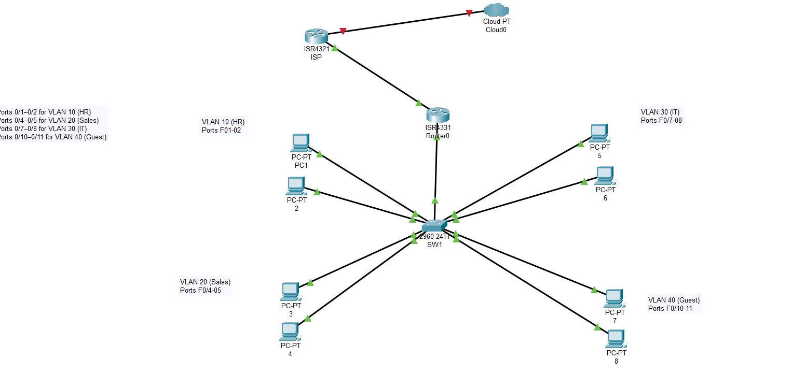

# Multi-VLAN Small Office Network

**Inter-VLAN Routing, DHCP, NAT, and ACL Security**

## 📋 Lab Overview
**Objective:** Design and configure a secure, segmented small office network with multiple VLANs and security policies.

## 🛠️ Skills Demonstrated
- VLAN segmentation and trunking
- Router-on-a-Stick configuration
- DHCP services per VLAN
- NAT for internet access
- Access Control Lists (ACLs)
- Network troubleshooting

## 🗂️ Lab Files
- [`multi-vlan-office-network.pkt`](./multi-vlan-office-network.pkt) - Download and open in Packet Tracer
- [`config-backups/`](./config-backups/) - Device configurations

## 📊 Network Topology

## 🔧 Configuration Details

### VLAN Table
| VLAN Name | VLAN ID | Subnet | Gateway |
|-----------|---------|---------|---------|
| HR | 10 | 192.168.10.0/24 | 192.168.10.1 |
| Sales | 20 | 192.168.20.0/24 | 192.168.20.1 |
| IT | 30 | 192.168.30.0/24 | 192.168.30.1 |
| Guest | 40 | 192.168.40.0/24 | 192.168.40.1 |

### Key Features
- **Inter-VLAN Routing:** Router-on-a-Stick
- **DHCP:** Dynamic IP assignment
- **NAT:** PAT for internet access
- **Security:** ACLs for Guest VLAN restrictions

## ✅ Verification & Testing
- Inter-VLAN communication verified
- Internet access confirmed
- Guest VLAN isolation tested

## 🎯 Learning Outcomes
- VLAN segmentation best practices
- Router subinterface configuration
- Network security implementation

---

*Lab completed: November 2025*  
**Author:** Vache Vardanyan

> **💡 Download the [Packet Tracer file](./multi-vlan-office-network.pkt) to explore this lab!**
